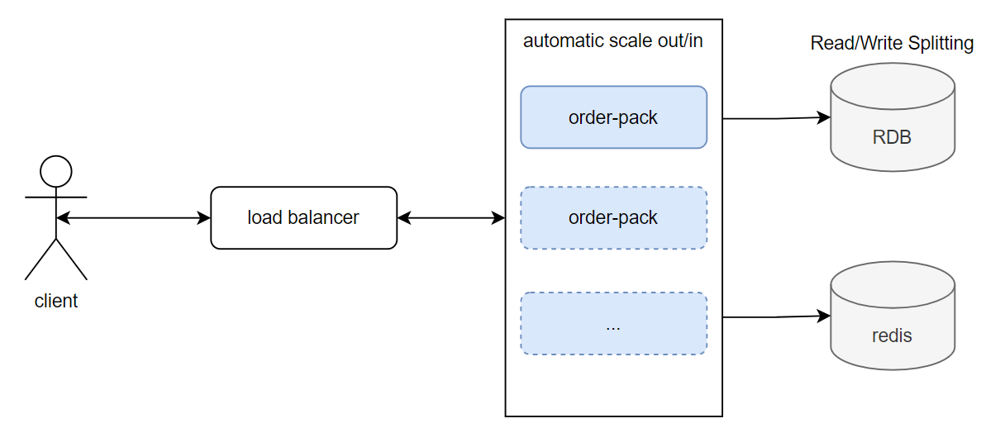
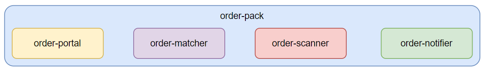
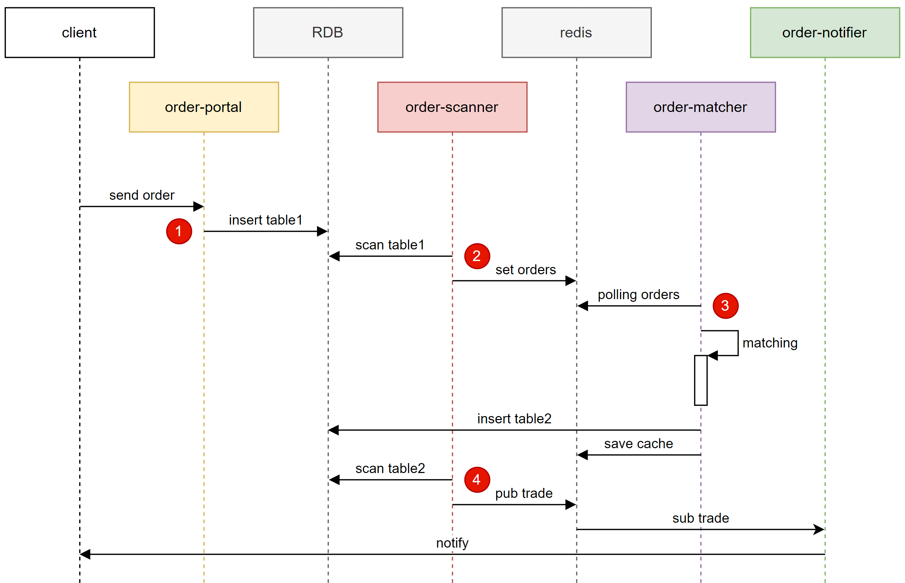

# aery-practice-order

(持續更新中, 撰寫的不美觀還請見諒)

 

這是一個關於 **訂單匹配系統** 的練習專案,

起因是我朋友的面試題目, 我覺得有趣且有挑戰性, 於是拿來練練手~

 

雖然題目描述得很簡約, 可明眼人一看就知道是一個要應付高併發場景的問題,

不僅僅是考驗程式要如何寫能在最快的時間內匹配大量買賣訂單, 且考驗高併發, 分散, 同步等架構狀況,

雖然我在工作實戰中, 並未真正面臨到高併發的議題,

但根據多年開發經驗以及對於系統設計的喜好與了解,

還有到處看工程師的血淚心聲等,

我清楚地知道應該要注意那些細節, 面臨的瓶頸在哪.

不過這樣仍然難說服別人 **我做得到**,

雖然我想出來的寫出來的不見得是最佳解,

但已是目前我能力所及的最佳解.

 

這專案基本上展現了我以下特點:

- 寫程式的熱情
- 設計系統的成就感
- 系統分析/架構規劃/程式設計/程式實作等能力
- 對 *spring* 的控制能力
- 對 *JPMS* 掌握\
  (這個話說我在 java8 的時候, 就利用 `ClassLoader` 設計實作 zero-down-time 熱部屬系統時, 就拉過類似的架構了,
  所以學習與使用起來並無太大障礙)

### 我也會在此詳細記錄我的設計思路, 這麼設計的好處是什麼 / 未來如何擴充 / 如何不斷因應上漲的業務量等等.

---

Imagine you have a trade engine that accepts orders via the protocol (or triggering)
you defined. An order request at least has this information (buy or sell, quantity,
market price or limit price).
The engine matches buy and sell orders that have the same price. Orders have the
same price determined by their timestamp (FIFO). Pending orders queue up in your
system until they are filled or killed. Your system will have multiple traders executing
orders at the same time.

What is expected?
===

- SOLID design accommodates requirements to change in the future.
- Testable, compilable and runnable code.
- Concurrent and thread-safe considered.
- Document your design which can be any human-readable form. For example,
  README file.
- A git repository can be accessed publicly.
- Golang are preferred but not required.

---

# Structure Overview

`order-pack` 實際上為複合系統, 由四個主要系統組成, 如下圖:

所以展開來實際架構如下圖:

架構中 `order-scanner` 通知 `order-notifier` 暫時是先設計透過 redis pub/sub 來通知,

這當然不是一個穩健的通知方式, 不過我的原則是:

**能夠減少組件就減少組件, 畢竟多一個組件就意味著額外的成本, 在業務量撐不起這些成本時, 那都是過度設計**

但是! 我有個大前提, 那就是:

**設計優良的架構, 面對混亂的發展**

所以在 `order-scanner` 與 `order-notifier` 對接 redis pub/sub 的部分,

將會設計 "**好的介面**" 來隔離 "**redis pub/sub 實作**" 用以面對未來的變動,

所以接下來將會不斷看到, 我在設計系統時預想初期能盡量縮減組件數量就縮減,

但是在介面與架構設計就絕不馬虎,

因為當到業務量或需求展開來的時候,

就會發現將底子打好是那麼的有成就感 :)

---

# Project Structure

| subproject                                  | description                                                                                      |
|---------------------------------------------|--------------------------------------------------------------------------------------------------|
| [misty-utils](misty-utils)                  | 來自另一個 repo 用 git submodule 引入, 為我長年工作累積的工具包, 僅相依 `slf4j-api` 的 java 原生專案                         |
| [order-customer](order-customer)            | 用來模擬客戶送出買賣訂單的系統, 可用於系統模擬                                                                         |
| [order-matcher-api](order-matcher-api)*     | 定義 **訂單匹配系統** 的操作介面                                                                              |
| [order-matcher-core](order-matcher-core)*   | 實作 **訂單匹配系統** 的操作介面, 與相關核心邏輯                                                                     |
| [order-notifier-api](order-notifier-api)*   | 定義 **訂單通知系統** 的操作介面                                                                              |
| [order-notifier-core](order-notifier-core)* | 實作 **訂單通知系統** 的操作介面, 與相關核心邏輯                                                                     |
| [order-pack](order-pack)                    | **訂單服務整合系統** 簡單來說就是大禮包, 將所有模組整合在一起執行, 可在業務量不大的時候節省成本 (這也是為什麼 structure overview 第一張圖看起來這麼簡約的原因了) |
| [order-portal-api](order-portal-api)*       | 定義 **訂單入口系統** 的操作介面, 簡單來說就是接受客戶買賣訂單的入口, 可以是http/websocket/gRPC等來源                                |
| [order-portal-http](order-portal-http)*     | 實作 **訂單入口系統** 的操作介面, 該實作是從http接受訂單                                                               |
| [order-scanner-api](order-scanner-api)*     | 定義 **訂單掃描系統** 的操作介面                                                                              |
| [order-scanner-core](order-scanner-core)*   | 實作 **訂單掃描系統** 的操作介面, 與相關核心邏輯                                                                     |
| [order-service-api](order-service-api)      | 定義 **訂單服務系統** 的操作介面, 簡單來說就是訂單的CRUD                                                               |
| [order-service-core](order-service-core)    | 實作 **訂單服務系統** 的操作介面, 採用 spring 3 autoconfig 載入機制, 預設連接 RDB                                       |
| [order-test](order-test)                    | 基本上就是一個整合測試環境, 除了相依4個核心邏輯模組外, 還相依了 `order-customer` 可直接跑完整的系統測試                                  |
| [order-utils](order-utils)                  | 跟訂單匹配系統核心邏輯無關的一些工具, 採用 spring 3 autoconfig 載入機制                                                  |

- 採用 java9 JPMS 隔離模組存取權限, 使用 `ServiceLoader` 來載入實作(解耦), 保證未來系統的彈性
- 這樣的架構可以很容易導入 *Facade* 概念, 例如今天 **訂單通知系統** 要擴充為 GCM + email, 則可以新增 `order-notifier-email`, `order-notifier-gcm`,
  然後 `order-notifier-core` 載入這兩個模組操作, 這樣就可以體現 *低耦合高內聚*
- RDB 採用 *讀寫分離* 維持系統的高響應
- 訂單進來寫入的 table1 為 *異步複製 (Asynchronous Replication)* 同步策略, 主庫寫入後立即返回, 後續由從庫同步 (影響使用者送出訂單的響應速度)
- 買賣成立寫入的 table2 為 *半同步複製 (Semi-Synchronous Replication)* 同步策略, 主庫寫入後與至少一個從庫同步後返回 (影響 `order-matcher` 與 RDB
  的響應速度)
- 上述資料寫入 RDB 後, 皆會直接在 redis 寫一份 cache 並給定 TTL, 因為使用者習慣會是送出請求後馬上再刷新查詢是否訂單有成立, 這樣做可以消除資料未同步造成
  client 的疑慮, 又可以維持高響應
- 打*的專案為核心模組, 可以獨立運作也可以被整合在一起執行, 也都可以 scale out/in, 達到系統的彈性與拓展性
- 這邊暫時沒有打算引入 `account` 模組處理 client 帳號問題, 雖然實作不難但略為麻煩, 且也不是練習題核心問題, 因此現階段先忽略

---

# Data Flow

1. client送出訂單:
2. scanner掃描待匹配的訂單:
3. matcher處理訂單匹配:
4. scanner掃描已成立的訂單:
