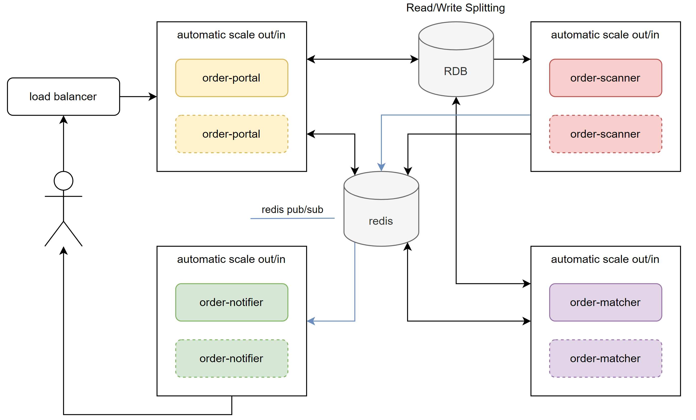

# aery-practice-order

about order matching system

---

Imagine you have a trade engine that accepts orders via the protocol (or triggering)
you defined. An order request at least has this information (buy or sell, quantity,
market price or limit price).
The engine matches buy and sell orders that have the same price. Orders have the
same price determined by their timestamp (FIFO). Pending orders queue up in your
system until they are filled or killed. Your system will have multiple traders executing
orders at the same time.

## What is expected?

- SOLID design accommodates requirements to change in the future.
- Testable, compilable and runnable code.
- Concurrent and thread-safe considered.
- Document your design which can be any human-readable form. For example,
  README file.
- A git repository can be accessed publicly.
- Golang are preferred but not required.

---

# structure overview:

`order-pack` 實際上為複合系統, 由四個主要系統組成, 如下圖:

所以展開來實際架構如下圖:

---

# project structure

| subproject                                  | description                                                              |
|---------------------------------------------|--------------------------------------------------------------------------|
| [misty-utils](misty-utils)                  | 來自另一個 repo 用 git submodule 引入, 為我長年工作累積的工具包, 僅相依 `slf4j-api` 的 java 原生專案 |
| [order-customer](order-customer)            | 用來模擬客戶送出買賣訂單的系統, 可用於系統模擬                                                 |
| [order-matcher-api](order-matcher-api)*     | 定義 **訂單匹配系統** 的操作介面                                                      |
| [order-matcher-core](order-matcher-core)*   | 實作 **訂單匹配系統** 的操作介面, 與相關核心邏輯                                             |
| [order-notifier-api](order-notifier-api)*   | 定義 **訂單通知系統** 的操作介面                                                      |
| [order-notifier-core](order-notifier-core)* | 實作 **訂單通知系統** 的操作介面, 與相關核心邏輯                                             |
| [order-pack](order-pack)                    | **訂單服務整合系統** 簡單來說就是大禮包, 將所有模組整合在一起執行, 可在業務量不大的時候節省成本                     |
| [order-portal-api](order-portal-api)*       | 定義 **訂單入口系統** 的操作介面, 簡單來說就是接受客戶買賣訂單的入口, 可以是http/websocket/gRPC等來源        |
| [order-portal-http](order-portal-http)*     | 實作 **訂單入口系統** 的操作介面, 該實作是從http接受訂單                                       |
| [order-scanner-api](order-scanner-api)*     | 定義 **訂單掃描系統** 的操作介面                                                      |
| [order-scanner-core](order-scanner-core)*   | 實作 **訂單掃描系統** 的操作介面, 與相關核心邏輯                                             |
| [order-service-api](order-service-api)      | 定義 **訂單服務系統** 的操作介面, 簡單來說就是訂單的CRUD                                       |
| [order-service-core](order-service-core)    | 實作 **訂單服務系統** 的操作介面, 採用 spring 3 autoconfig 載入機制, 預設連接 RDB               |
| [order-test](order-test)                    | 基本上就是一個整合測試環境, 除了相依4個核心邏輯模組外, 還相依了 `order-customer` 可直接跑完整的系統測試          |
| [order-utils](order-utils)                  | 跟訂單匹配系統核心邏輯無關的一些工具, 採用 spring 3 autoconfig 載入機制                          |

- 採用 java9 JPMS 隔離專案存取權限, 使用 `ServiceLoader` 來載入實作, 用以解耦所有實作, 保證未來系統的彈性
- 這樣的架構可以很容易導入 *Facade* 概念, 例如今天 **訂單通知系統** 要擴充為 GCM + email, 則可以新增 `order-notifier-email`, `order-notifier-gcm`,
  然後 `order-notifier-core` 載入這兩個模組操作, 這樣就可以體現 *低耦合高內聚*
- RDB 採用 *讀寫分離* 維持系統的高響應
- 訂單進來寫入的 table 為 *異步複製 (Asynchronous Replication)* 同步策略, 主庫寫入後立即返回, 後續由從庫同步 (影響使用者送出訂單的響應速度)
- 買賣成立寫入的 table 為 *半同步複製 (Semi-Synchronous Replication)* 同步策略, 主庫寫入後與至少一個從庫同步後返回 (影響 `order-matcher` 與 RDB
  的響應速度)
- 上述資料寫入 RDB 後, 皆會直接在 redis 寫一份 cache 並給定 TTL, 因為使用者習慣會是送出請求後馬上再刷新查詢是否訂單有成立, 這樣做可以消除資料未同步造成
  client 的疑慮, 又可以維持高響應
- 打*的專案為核心模組, 可以獨立運作也可以被整合在一起執行, 也都可以 scale out/in, 達到系統的彈性與拓展性

---

